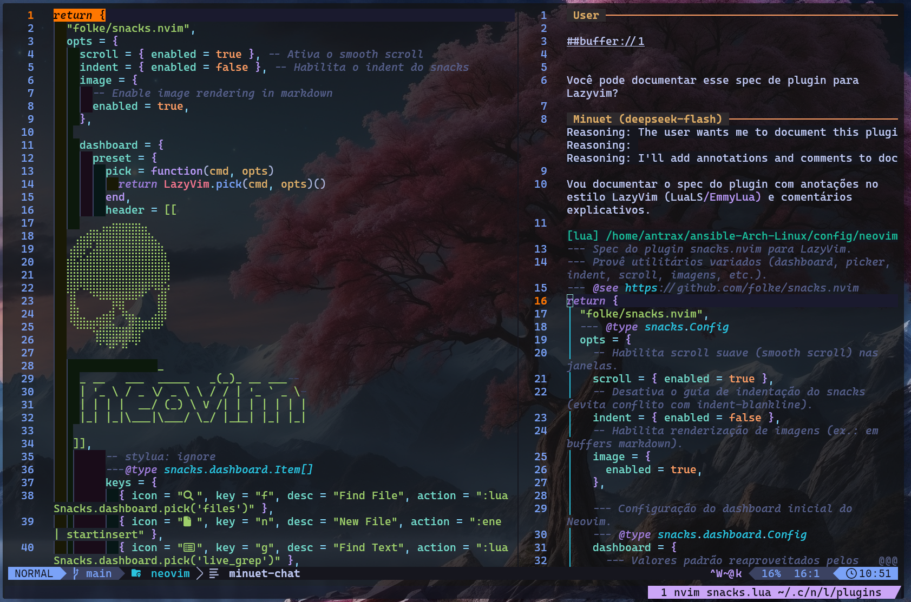

<div align="center">

# Minuet Chat for Neovim

[](https://github.com/antraxbr666/minuet-chat.nvim/commits)
[](LICENSE)
[](https://neovim.io/)



</div>

minuet-chat.nvim brings AI chat capabilities directly into Neovim with support for any OpenAI-compatible API provider.

- 🤖 **Multiple AI Providers** - Works with any OpenAI-compatible API (OpenAI, Ollama, Mistral.ai, local models, etc.) - just configure your API key and base URL
- 🔧 **Tool Calling** - LLM can call workspace functions (file reading, git operations, search) with manual approval or automatic execution for trusted tools
- 🔒 **Privacy First** - Only shares what you explicitly request - no background data collection
- 📝 **Interactive Chat** - Interactive UI with completion, diffs, and quickfix integration
- 🎯 **Smart Prompts** - Composable templates and sticky prompts for consistent context
- ⚡ **Token Efficient** - Resource replacement prevents duplicate context, history management via tiktoken counting
- 🔗 **Scriptable** - Comprehensive Lua API for automation and headless mode operation
- 🔌 **Extensible** - [Custom functions](#functions) and [providers](#providers), plus integrations like [mcphub.nvim](https://github.com/ravitemer/mcphub.nvim)

# Installation

## Requirements

- [Neovim 0.10.0+](https://neovim.io/)
- [curl 8.0.0+](https://curl.se/)
- [plenary.nvim](https://github.com/nvim-lua/plenary.nvim)

> [!WARNING]
> For Neovim < 0.11.0, add `noinsert` or `noselect` to your `completeopt` otherwise chat autocompletion will not work.
> For best autocompletion experience, also add `popup` to your `completeopt` (even on Neovim 0.11.0+).

## Optional Dependencies

- [tiktoken_core](https://github.com/gptlang/lua-tiktoken) - For accurate token counting
  - Arch Linux: Install [`luajit-tiktoken-bin`](https://aur.archlinux.org/packages/luajit-tiktoken-bin) or [`lua51-tiktoken-bin`](https://aur.archlinux.org/packages/lua51-tiktoken-bin) from AUR
  - Via luarocks: `sudo luarocks install --lua-version 5.1 tiktoken_core`
  - Manual: Download from [lua-tiktoken releases](https://github.com/gptlang/lua-tiktoken/releases) and save as `tiktoken_core.so` in your Lua path
- [git](https://git-scm.com/) - For git diff context features
- [ripgrep](https://github.com/BurntSushi/ripgrep) - For improved search performance
- [lynx](https://lynx.invisible-island.net/) - For improved URL context features

## Integration with pickers

For various plugin pickers to work correctly, you need to replace `vim.ui.select` with your desired picker (as the default `vim.ui.select` is very basic). Here are some examples:

- [fzf-lua](https://github.com/ibhagwan/fzf-lua?tab=readme-ov-file#neovim-api) - call `require('fzf-lua').register_ui_select()`
- [telescope](https://github.com/nvim-telescope/telescope-ui-select.nvim?tab=readme-ov-file#telescope-setup-and-configuration) - setup `telescope-ui-select.nvim` plugin
- [snacks.picker](https://github.com/folke/snacks.nvim/blob/main/docs/picker.md#%EF%B8%8F-config) - enable `ui_select` config
- [mini.pick](https://github.com/echasnovski/mini.pick/blob/main/lua/mini/pick.lua#L1229) - set `vim.ui.select = require('mini.pick').ui_select`

## [lazy.nvim](https://github.com/folke/lazy.nvim)

```lua
return {
  {
    "antraxbr666/minuet-chat.nvim",
    dependencies = {
      { "nvim-lua/plenary.nvim", branch = "master" },
    },
    build = "make tiktoken",
    opts = {
      -- See Configuration section for options
    },
  },
}
```

## [LazyVim](https://www.lazyvim.org/)

Create `lua/plugins/minuet-chat.lua`. The plugin is lazy-loaded on its commands and keymaps:

```lua
-- lua/plugins/minuet-chat.lua
return {
  {
    "antraxbr666/minuet-chat.nvim",
    main = "MinuetChat",
    build = "make tiktoken",
    cmd = {
      "MinuetChat",
      "MinuetChatOpen",
      "MinuetChatClose",
      "MinuetChatToggle",
      "MinuetChatStop",
      "MinuetChatReset",
      "MinuetChatModels",
      "MinuetChatPrompts",
      "MinuetChatSave",
      "MinuetChatLoad",
      "MinuetChatExplain",
      "MinuetChatReview",
      "MinuetChatFix",
      "MinuetChatOptimize",
      "MinuetChatDocs",
      "MinuetChatTests",
      "MinuetChatCommit",
    },
    dependencies = {
      { "nvim-lua/plenary.nvim", branch = "master" },
    },
    opts = {
      -- See Configuration section for options
    },
    keys = {
      { "<leader>ac", "<cmd>MinuetChatToggle<cr>", mode = { "n", "v" }, desc = "Minuet Chat" },
      { "<leader>am", "<cmd>MinuetChatModels<cr>", desc = "Minuet Models" },
    },
  },
}
```

> [!NOTE]
> Prompt commands such as `:MinuetChatDocs` are created by `setup()`. List them in `cmd` so they work before the plugin is loaded.

### which-key group

Without a group, which-key shows `<leader>a` as `+2 keymaps`. To show a named group with an icon, register it in a separate file, `lua/plugins/which-key.lua`:

```lua
-- lua/plugins/which-key.lua
return {
  "folke/which-key.nvim",
  opts = {
    spec = {
      { "<leader>a", group = "Minuet Chat", icon = { icon = "🤖", color = "purple" } },
      { "<leader>ac", icon = { icon = "🤖", color = "purple" } },
      { "<leader>am", icon = { icon = "󰚩", color = "cyan" } },
    },
  },
}
```

LazyVim merges `spec` (`opts_extend = { "spec" }`), so the default groups are kept. Restart Neovim to apply.

> [!TIP]
> Some terminals render the 🤖 emoji two columns wide, which misaligns the menu. If that happens, use the Nerd Font icon `󰚩` (`nf-md-robot`) instead.

## [vim-plug](https://github.com/junegunn/vim-plug)

```vim
call plug#begin()
Plug 'nvim-lua/plenary.nvim'
Plug 'antraxbr666/minuet-chat.nvim'
call plug#end()

lua << EOF
require("MinuetChat").setup()
EOF
```

# Core Concepts

- **Resources** (`#<name>`) - Add specific content (files, git diffs, URLs) to your prompt
- **Tools** (`@<name>`) - Give LLM access to functions it can call during the chat, with manual approval by default
- **Sticky Prompts** (`> <text>`) - Persist context across single chat session
- **Models** (`$<model>`) - Specify which AI model to use for the chat
- **Prompts** (`/PromptName`) - Use predefined prompt templates for common tasks

> [!TIP]
> Press `<Tab>` after typing `#` or `@` to see available options and auto-complete. This is the easiest way to discover what's available!

# Usage

## Commands

| Command                    | Description                   |
| -------------------------- | ----------------------------- |
| `:MinuetChat <input>?`    | Open chat with optional input |
| `:MinuetChatOpen`         | Open chat window              |
| `:MinuetChatClose`        | Close chat window             |
| `:MinuetChatToggle`       | Toggle chat window            |
| `:MinuetChatStop`         | Stop current output           |
| `:MinuetChatReset`        | Reset chat window             |
| `:MinuetChatSave <name>?` | Save chat history             |
| `:MinuetChatLoad <name>?` | Load chat history             |
| `:MinuetChatPrompts`      | View/select prompt templates  |
| `:MinuetChatModels`       | View/select available models  |
| `:MinuetChat<PromptName>` | Use specific prompt template  |

## Chat Key Mappings

| Insert  | Normal  | Action                                               |
| ------- | ------- | ---------------------------------------------------- |
| `<Tab>` | -       | **Autocomplete resources/files/options** (use this!) |
| `<C-c>` | `q`     | Close the chat window                                |
| `<C-l>` | `<C-l>` | Reset and clear the chat window                      |
| `<C-s>` | `<CR>`  | Submit the current prompt                            |
| `<C-y>` | `<C-y>` | Accept nearest diff                                  |
| -       | `gj`    | Jump to section of nearest diff                      |
| -       | `gqa`   | Add all answers from chat to quickfix                |
| -       | `gqd`   | Add all diffs from chat to quickfix                  |
| -       | `gy`    | Yank nearest diff to register                        |
| -       | `gd`    | Show diff between source and nearest diff            |
| -       | `gc`    | Show info about current chat                         |
| -       | `gh`    | Show help message                                    |

**💡 Pro tip:** After typing `#`, `@`, `#buffer:`, or `#file:`, press `<Tab>` to see available options. This is the fastest way to work!

> [!NOTE]
> **Tab key not working?** Some plugins (e.g. `copilot.vim`) also map `<Tab>` in insert mode.  
> To fix conflicts, disable the other plugin's `<Tab>` mapping:
>
> ```lua
> -- For copilot.vim
> vim.g.copilot_no_tab_map = true
> vim.keymap.set('i', '<S-Tab>', 'copilot#Accept("\\<S-Tab>")', { expr = true, replace_keycodes = false })
> ```
>
> Or customize MinuetChat keymaps in your config.

## Predefined Functions

All predefined functions belong to the `minuet` group.

| Function    | Manual `#...` | Description                                            | Available Options                                                     |
| ----------- | ------------- | ------------------------------------------------------ | --------------------------------------------------------------------- |
| `bash`      | No            | Executes a bash command and returns output             | Tool-only (use `@minuet`)                                            |
| `buffer`    | Yes           | Retrieves content from buffer(s) with diagnostics      | `active`, `visible`, `listed`, `quickfix`, buffer number, or filename |
| `clipboard` | Yes           | Provides access to system clipboard content            | No options                                                            |
| `edit`      | No            | Applies a unified diff to a file                       | Tool-only (use `@minuet`)                                            |
| `file`      | Yes           | Reads content from a specified file path               | Any file path (use `<Tab>` for completion)                            |
| `gitdiff`   | Yes           | Retrieves git diff information                         | `unstaged` (default), `staged`, or commit SHA                         |
| `glob`      | Yes           | Lists filenames matching a pattern in workspace        | Any glob pattern (default: `**/*`)                                    |
| `grep`      | Yes           | Searches for a pattern across files in workspace       | Any search pattern                                                    |
| `selection` | Yes           | Includes the current visual selection with diagnostics | No options                                                            |
| `url`       | Yes           | Fetches content from a specified URL                   | Any HTTPS URL                                                         |

- **`#<function>`** - Embeds output directly in your message (e.g., `#buffer:listed`, `#file:src/main.lua`)
- **`@<function/group>`** - Makes function(s) available for LLM to call when needed (e.g., `@minuet`, `@file`)

## Predefined Prompts

| Prompt     | Description                                                            |
| ---------- | ---------------------------------------------------------------------- |
| `Explain`  | Write detailed explanation of selected code as paragraphs              |
| `Review`   | Comprehensive code review with line-specific issue reporting           |
| `Fix`      | Identify problems and rewrite code with fixes and explanation          |
| `Optimize` | Improve performance and readability with optimization strategy         |
| `Docs`     | Add documentation comments to selected code                            |
| `Tests`    | Generate tests for selected code                                       |
| `Commit`   | Generate commit message with commitizen convention from staged changes |

## Resource Usage

```markdown
# Current buffer

#buffer:active

# All open buffers (replaces old #buffers)

#buffer:listed

# All visible buffers

#buffer:visible

# Specific file

#file:src/main.lua

# Git changes

#gitdiff:staged

# URL content

#url:https://example.com/docs
```

## Tool Usage

When you use `@minuet`, the LLM can call functions from the `minuet` group such as `bash`, `edit`, `file`, `glob`, `grep`, and `gitdiff`.

```markdown
# Give LLM access to workspace tools

@minuet What files are in this project?

# Sticky context with tools

> #buffer:listed
> @minuet
> Refactor the authentication code
```

By default, tool calls require manual approval. Configure `trusted_tools` to automatically run specific tools (see [Functions](#functions)).

> [!WARNING]
> `trusted_tools = true` allows the model to run every enabled tool without asking. Only use it if you fully trust the tool set and workspace.

# Configuration

For all available configuration options, see [`lua/MinuetChat/config.lua`](lua/MinuetChat/config.lua).

## Quick Setup

Most users only need to configure a few options:

```lua
{
  model = 'gpt-6-luna',        -- AI model to use
  temperature = 0.1,           -- Lower = focused, higher = creative
  trusted_tools = nil,         -- Require approval for all tool calls
  window = {
    layout = 'vertical',       -- 'vertical', 'horizontal', 'float'
    width = 0.5,              -- 50% of screen width
  },
  auto_insert_mode = true,     -- Enter insert mode when opening
}
```

## Window & Appearance

```lua
{
  window = {
    layout = 'float',
    width = 80, -- Fixed width in columns
    height = 20, -- Fixed height in rows
    border = 'rounded', -- 'single', 'double', 'rounded', 'solid'
    title = '🤖 AI Assistant',
    zindex = 100, -- Ensure window stays on top
  },

  headers = {
    user = '👤 You',
    assistant = '🤖 Minuet',
    tool = '🔧 Tool',
  },

  separator = '━━',
  auto_fold = true, -- Automatically folds non-assistant messages
}
```

`window.layout` also supports `'replace'` to reuse the current window.

## Buffer Behavior

```lua
-- Auto-command to customize chat buffer behavior
vim.api.nvim_create_autocmd('BufEnter', {
  pattern = 'minuet-chat',
  callback = function()
    vim.opt_local.relativenumber = false
    vim.opt_local.number = false
    vim.opt_local.conceallevel = 0
  end,
})
```

## Highlights

You can customize colors by setting highlight groups in your config:

```lua
-- In your colorscheme or init.lua
vim.api.nvim_set_hl(0, 'MinuetChatHeader', { fg = '#7C3AED', bold = true })
vim.api.nvim_set_hl(0, 'MinuetChatSeparator', { fg = '#374151' })
```

Types of highlights:

- `MinuetChatHeader` - Header highlight in chat buffer
- `MinuetChatSeparator` - Separator highlight in chat buffer
- `MinuetChatSelection` - Selection highlight in source buffer
- `MinuetChatStatus` - Status and spinner in chat buffer
- `MinuetChatHelp` - Help text in chat buffer
- `MinuetChatResource` - Resource highlight in chat buffer (e.g. `#file`, `#gitdiff`)
- `MinuetChatTool` - Tool call highlight in chat buffer (e.g. `@minuet`)
- `MinuetChatPrompt` - Prompt highlight in chat buffer (e.g. `/Explain`, `/Review`)
- `MinuetChatModel` - Model highlight in chat buffer (e.g. `$gpt-6-luna`)
- `MinuetChatUri` - URI highlight in chat buffer (e.g. `##https://...`)
- `MinuetChatAnnotation` - Annotation highlight in chat buffer (file headers, tool call headers, tool call body)
- `MinuetChatAnnotationHeader` - Annotation header highlight in chat buffer

## Prompts

Define your own prompts in the configuration:

```lua
{
  prompts = {
    MyCustomPrompt = {
      prompt = 'Explain how it works.',
      system_prompt = 'You are very good at explaining stuff',
      mapping = '<leader>ccmc',
      description = 'My custom prompt description',
    },
    Yarrr = {
      system_prompt = 'You are fascinated by pirates, so please respond in pirate speak.',
    },
    NiceInstructions = {
      system_prompt = 'You are a nice coding tutor, so please respond in a friendly and helpful manner.',
    }
  }
}
```

## Functions

Use `trusted_tools` to control which tool calls are executed automatically:

```lua
{
  trusted_tools = nil, -- default: require approval for all tool calls

  -- trust all functions in a group
  -- trusted_tools = 'minuet',

  -- trust specific functions by name or groups by name
  -- trusted_tools = { 'file', 'glob', 'grep' },

  -- trust every enabled tool call
  -- trusted_tools = true,
}
```

**How tool trust works:**

A tool is trusted when any of these match:

- Its function definition sets `trusted = true`
- Its function name appears in `trusted_tools`
- Its function group appears in `trusted_tools`
- `trusted_tools = true`

**Recommended setup:** Trust read-only functions like `file`, `glob`, or `grep` for a smoother workflow without compromising safety.

> [!WARNING]
> Trusted tools run without asking for confirmation. Be especially careful with tools like `bash` and `edit`, which can change your workspace.

Define your own functions in the configuration with input handling and schema:

```lua
{
  functions = {
    birthday = {
      description = 'Retrieves birthday information for a person',
      uri = 'birthday://{name}',
      trusted = false,
      schema = {
        type = 'object',
        required = { 'name' },
        properties = {
          name = {
            type = 'string',
            enum = { 'Alice', 'Bob', 'Charlie' },
            description = "Person's name",
          },
        },
      },
      resolve = function(input)
        return {
          {
            uri = 'birthday://' .. input.name,
            mimetype = 'text/plain',
            data = input.name .. ' birthday info',
          },
        }
      end,
    },
  }
}
```

If a function has a `uri`, it can be used manually with `#birthday:Alice`. Functions without a `uri` are tool-only and can only be called by the model.

## Providers

The plugin comes with a built-in `openai` provider that works with any OpenAI-compatible API.

### OpenAI

```lua
{
  providers = {
    openai = {
      api_key = 'sk-...',
      base_url = 'https://api.openai.com/v1',
      models = {
        { id = 'gpt-6-luna', name = 'GPT-6 Luna', max_input_tokens = 1050000, max_output_tokens = 128000, streaming = true, tools = true },
        { id = 'gpt-6.1-sol', name = 'GPT-6.1 Sol', max_input_tokens = 1050000, max_output_tokens = 128000, streaming = true, tools = true },
      },
    },
  }
}
```

### DeepSeek

```lua
{
  providers = {
    openai = {
      api_key = vim.env.DEEPSEEK_API_KEY,
      base_url = 'https://api.deepseek.com',
      models = {
        { id = 'deepseek-flash', name = 'DeepSeek Flash', max_input_tokens = 1000000, max_output_tokens = 384000, streaming = true, tools = true },
        { id = 'deepseek-v4-pro', name = 'DeepSeek V4 Pro', max_input_tokens = 1000000, max_output_tokens = 384000, streaming = true, tools = true },
      },
    },
  }
}
```

### Ollama (local)

```lua
{
  providers = {
    openai = {
      api_key = 'ollama',
      base_url = 'http://localhost:11434/v1',
      models = {
        { id = 'llama3.2', name = 'Llama 3.2', max_input_tokens = 128000, max_output_tokens = 4096, streaming = true, tools = true },
        { id = 'qwen2.5-coder', name = 'Qwen 2.5 Coder', max_input_tokens = 128000, max_output_tokens = 4096, streaming = true, tools = true },
      },
    },
  }
}
```

You can also add custom providers:

```lua
{
  providers = {
    my_provider = {
      get_url = function(opts) return 'https://api.example.com/chat' end,
      get_headers = function() return { ['Authorization'] = 'Bearer ' .. api_key } end,
      get_models = function() return { { id = 'my-model', name = 'My Model' } } end,
      prepare_input = require('MinuetChat.config.providers').openai.prepare_input,
      prepare_output = require('MinuetChat.config.providers').openai.prepare_output,
    }
  }
}
```

**Provider Interface:**

```lua
{
  -- Optional: Disable provider
  disabled?: boolean,

  -- Optional: Extra info about the provider displayed in info panel
  get_info?(headers: table): string[]

  -- Optional: Get extra request headers with optional expiration time
  get_headers?(): table<string,string>, number?,

  -- Optional: Get API endpoint URL
  get_url?(opts: MinuetChat.Provider.options): string,

  -- Optional: Prepare request input
  prepare_input?(inputs: table<MinuetChat.Provider.input>, opts: MinuetChat.Provider.options): table,

  -- Optional: Prepare response output
  prepare_output?(output: table, opts: MinuetChat.Provider.options): MinuetChat.Provider.output,

  -- Optional: Get available models
  get_models?(headers: table): table<MinuetChat.Provider.model>,

  -- Optional: Resolve a user-facing model id to a provider model id.
  -- Second return value is optional extra request headers.
  resolve_model?(headers: table, model: string): string, table?,
}
```

**Built-in providers:**

- `openai` - OpenAI-compatible API (default)

# API Reference

## Core

```lua
local chat = require('MinuetChat')

-- Basic Chat Functions
chat.ask(prompt, config)      -- Ask a question with optional config

-- Window Management
chat.open(config)             -- Open chat window with optional config
chat.close()                  -- Close chat window
chat.toggle(config)           -- Toggle chat window visibility with optional config
chat.reset()                  -- Reset the chat
chat.stop()                   -- Stop current output

-- Prompt & Model Management
chat.select_prompt(config)    -- Open prompt selector with optional config
chat.select_model()           -- Open model selector

-- History Management
chat.load(name, history_path) -- Load chat history
chat.save(name, history_path) -- Save chat history

-- Configuration
chat.setup(config)            -- Update configuration
chat.log_level(level)         -- Set log level (debug, info, etc.)
```

## Chat Window

You can also access the chat window UI methods through the `chat.chat` object:

```lua
local window = require('MinuetChat').chat

-- Chat UI State
window:visible()             -- Check if chat window is visible
window:focused()             -- Check if chat window is focused

-- Message Management
window:get_message(role, cursor)               -- Get chat message by role, either last or closest to cursor
window:add_message({ role, content }, replace) -- Add or replace a message in chat
window:remove_message(role, cursor)            -- Remove chat message by role, either last or closest to cursor
window:get_block(role, cursor)                 -- Get code block by role, either last or closest to cursor

-- Content Management
window:append(text)          -- Append text to chat window
window:clear()               -- Clear chat window content
window:start()               -- Start writing to chat window
window:finish()              -- Finish writing to chat window

-- Source Management
window:get_source()          -- Get the current source buffer and window
window:set_source(winnr)     -- Set the source window

-- Navigation
window:follow()              -- Move cursor to end of chat content
window:focus()               -- Focus the chat window

-- Advanced Features
window:overlay(opts)         -- Show overlay with specified options
```

## Prompt parser

```lua
local parser = require('MinuetChat.prompts')

parser.resolve_prompt()         -- Resolve prompt references
parser.resolve_tools()          -- Resolve tools shared with the model via @...
parser.resolve_functions()      -- Resolve manual function/resource references via #...
parser.resolve_model()          -- Resolve model from prompt (WARN: async, requires plenary.async.run)
```

## Example Usage

```lua
-- Open chat, ask a question and handle response
require('MinuetChat').open()
require('MinuetChat').ask('#buffer Explain this code', {
  callback = function(response)
    vim.notify('Got response: ' .. vim.trim(response.content):sub(1, 50) .. '...')
  end,
})

-- Save and load chat history
require('MinuetChat').save('my_debugging_session')
require('MinuetChat').load('my_debugging_session')

-- Use custom sticky and model
require('MinuetChat').ask('How can I optimize this?', {
  model = 'gpt-6-luna',
  sticky = { '#buffer', '#gitdiff:staged' },
})

-- Automatically trust a small read-only tool set
require('MinuetChat').setup({
  trusted_tools = { 'file', 'glob', 'grep' },
})
```


# Development

## Setup

To set up the environment:

1. Clone the repository:

```bash
git clone https://github.com/antraxbr666/minuet-chat.nvim
cd minuet-chat.nvim
```

2. Install the development tools: [StyLua](https://github.com/JohnnyMorganz/StyLua) for formatting and [pandoc](https://pandoc.org/) for `make docs`. On Arch Linux:

```bash
sudo pacman -S stylua pandoc-cli
```

3. Run the tests:

```bash
make test
```

4. Check formatting:

```bash
stylua --check .
```

5. After editing `README.md`, regenerate the vimdoc:

```bash
make docs
```

## Contributing

1. Fork the repository
2. Create your feature branch
3. Make your changes
4. Run tests and lint checks
5. Submit a pull request

See [CONTRIBUTING.md](/CONTRIBUTING.md) for detailed guidelines.

# Credits

minuet-chat.nvim is a fork of [CopilotChat.nvim](https://github.com/CopilotC-Nvim/CopilotChat.nvim), reworked to use any OpenAI-compatible API instead of GitHub Copilot. Thanks to its authors and contributors for the original work. Both projects are licensed under the [GPL-3.0](LICENSE).
